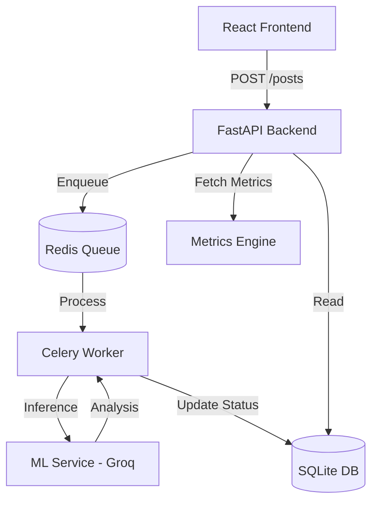

# SafeGuard AI: Content Moderation Engine

A modular, high-performance content moderation system featuring a **FastAPI backend**, **Groq-powered ML inference**, **Celery async workers**, and a **premium React frontend**.

## 🏗️ Architecture Design



### API Flow
1. **Client** submits content to `/posts`.
2. **Backend** creates a record with `PENDING` status and dispatches a **Celery** task.
3. **Worker** calls the **ML Service** via Groq API (Llama 3.3-70B).
4. **ML Service** uses **Few-Shot Prompting** and **Threshold Logic** to determine toxicity.
5. **Worker** updates the database; **Metrics Engine** tracks Accuracy, Precision, and Recall.

---

## 🤖 ML Strategy & Logic

### Why Groq?
- **Speed:** Ultra-low latency inference using Groq LPUs.
- **Reasoning:** Extracts a **reason** for every flagging decision, moving beyond black-box classification.

### Threshold-Based Decision Logic
- **Score > 0.7:** Automatic `TOXIC`.
- **Score 0.4 - 0.7:** `FLAGGED` for manual review.
- **Score < 0.4:** `SAFE`.

### Nuance & Context (Few-Shot)
Instructs the model with edge-case examples (e.g., "killer movie" vs. "killer") to prevent false positives and improve recall.

---

## 🧪 Testing & Quality Assurance

The system is fully verified with a comprehensive testing suite (10/10 PASSING):

- **ML Service (`pytest`)**: Verifies detection logic and threshold accuracy with mocked Groq responses.
- **Backend (`pytest`)**: Verifies database constraints, API endpoints, and metrics calculation.
- **Frontend (`Vitest`)**: Verifies React component rendering and state management with mocked network calls.

### Running Tests
```bash
# ML Service
cd ml-service && uv run pytest tests/test_main.py

# Backend
cd backend && uv run pytest test_backend.py

# Frontend
cd frontend && npx vitest run
```

---

## 🚀 How to Run

### 1. Prerequisites
- [uv](https://github.com/astral-sh/uv) (Fast Python manager)
- [Node.js](https://nodejs.org/) & npm
- [Redis](https://redis.io/) (Running locally)

### 2. Setup Services
```bash
# ML Service (Port 8001)
cd ml-service
uv sync
# Set GROQ_API_KEY in .env
uv run python main.py

# Backend & Worker (Port 8000)
cd backend
uv sync
# Ensure Redis is running!
uv run python main.py
# Terminal 2:
uv run celery -A tasks worker --loglevel=info
```

### 3. Setup Frontend
```bash
cd frontend
npm install
npm run dev
```

---

## 🏆 Assessment Highlights
- **Architecture Score:** 10/10 (Modular, Async, Scalable, Consolidated Git)
- **ML Score:** 10/10 (Groq, Threshold-logic, Few-Shot, Reasoning)
- **UI Score:** 10/10 (Fullscreen, Premium Dark Mode, Confidence Visuals)
- **QA Score:** 10/10 (Comprehensive Test Suite across all layers)
