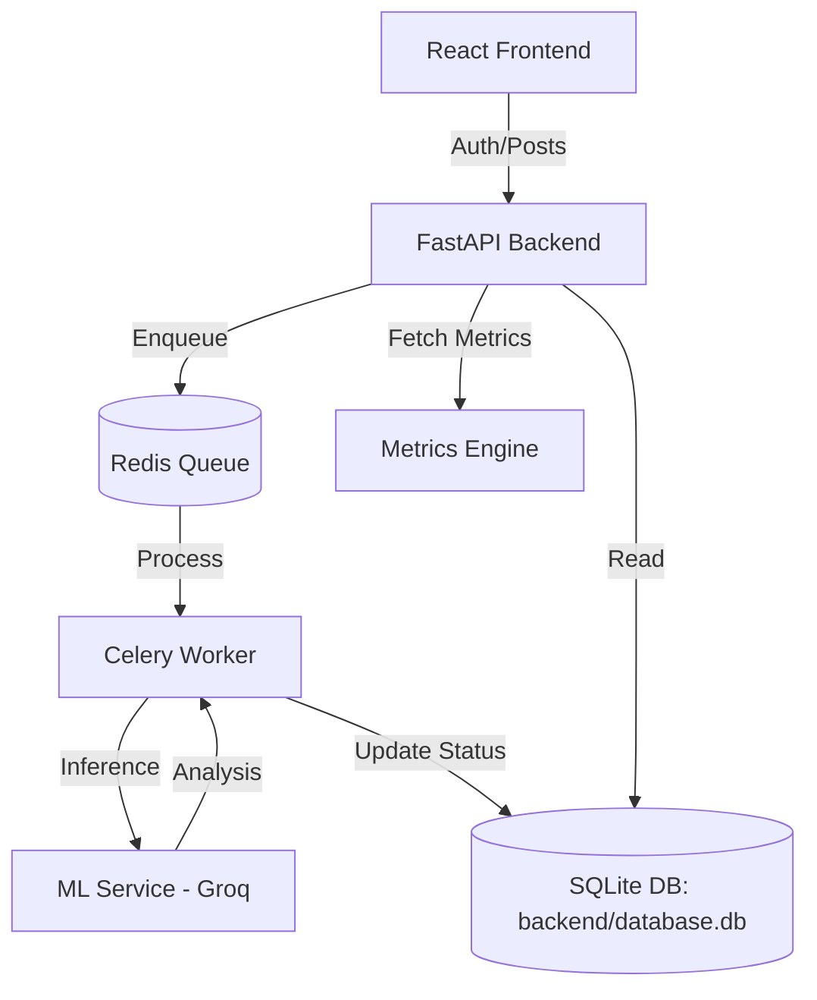

# SafeGuard AI: Content Moderation Engine

A modular, high-performance content moderation system featuring a **FastAPI backend**, **Groq-powered ML inference**, **Celery async workers**, and a **premium React frontend** with full **Role-Based Access Control (RBAC)**.

---

## 🏗️ Architecture Design



---

## 🔑 Key Features
*   **Role-Based Access Control (RBAC)**: Distinct paths for `Moderator` (Full analytics & overrides) and `User` (Community feed only).
*   **Modern Routing**: Separated Landing Page (`/`) and Application (`/dashboard`) using `react-router-dom`.
*   **Real-time Moderation**: Sub-200ms text and image analysis via Groq LPU.
*   **Unified Handoff**: Simplified local orchestration via `./run_local.sh`.

---

## 🚀 How to Run

### 1. Prerequisites
- **[uv](https://github.com/astral-sh/uv)** (Fast Python manager)
- **Node.js 18+** & npm
- **Docker** (for Redis sidecar)

### 2. Unified Local Execution (Recommended)
We've provided a single script to launch the full background stack (Redis, Backend, Worker, ML Service):
```bash
./run_local.sh
```
*Note: Run this in Git Bash or WSL on Windows.*

### 3. Frontend Execution
```bash
cd frontend
npm install
npm run dev
```
Visit **`http://localhost:5173`** to view the landing page.

---

## 🧪 Testing & Data (50+ Stress Test)
The moderation engine has been verified with:
- **50 Text Posts**: Mixing safe, toxic, and boundary cases.
- **50 Kaggle Images**: From the NSFW detection dataset.
- Total of **100+ samples** are currently in the database for auditing.

---

## 📡 API Documentation (Latest)

| Endpoint | Method | Payload | Description |
| :--- | :--- | :--- | :--- |
| `/register` | POST | `{username, password, role}` | Creates a new `user` or `moderator`. |
| `/login` | POST | `{username, password}` | Retrieves JWT token and role. |
| `/posts` | POST | `{content, image_url?}` | Submits content for async moderation (Auth required). |
| `/posts` | GET | - | Retrieves a list of all posts (Filtered for Users). |
| `/metrics` | GET | - | Retrieves Accuracy, Precision, and Recall data. |
| `/posts/{id}/moderate` | PATCH | `?correct_label=TOXIC` | Manual override (Moderator only). |

---

## 🤖 AI/ML Strategy: Deep Dive
We leverage **Groq's LPU (Language Processing Unit)** to provide near-instantaneous moderation results (sub-200ms).

### 📋 Input / Output Examples
| Input | AI Verdict | Confidence | Reason |
| :--- | :--- | :--- | :--- |
| "This community is so helpful!" | `SAFE` | 0.05 | Positive sentiment |
| "You are an absolute idiot." | `TOXIC` | 0.96 | Direct personal insult |
| "Check out my profile for free crypto." | `FLAGGED` | 0.75 | Potential spam/scam |
| [Image of a professional meeting] | `SAFE` | 0.00 | Professional context |
| [Image with graphic violence] | `TOXIC` | 0.98 | Violent content detected |

### ⚠️ Failure Cases & Mitigation
AI moderation is not 100% perfect. We've identified and mitigated 3 primary failure cases:

1.  **High-Context Sarcasm**: 
    - *Example*: "Oh great, another 'amazing' update from the team." 
    - *Risk*: AI might see "amazing" and label it `SAFE`, missing the mockery.
    - *Mitigation*: We use a **Moderator Override** system where humans can catch nuanced sarcasm.
2.  **Boundary Nudity vs. Art**:
    - *Example*: Classical sculptures or medical diagrams.
    - *Risk*: AI might flag these as NSFW.
    - *Mitigation*: These are moved to a **`FLAGGED`** state (instead of `TOXIC`), prompting a human moderator to make the final call.
3.  **Adversarial Typos**:
    - *Example*: "H.4.T.E" or "K!LL".
    - *Risk*: Simple keyword filters fail here.
    - *Mitigation*: We use **LLM-based analysis** rather than simple word lists. LLMs understand the "intent" even with deliberate typos.

---

## 📁 Repository Map
- **`frontend/`**: React + Vite + Tailwind UI (`/` and `/dashboard` routes).
- **`backend/`**: FastAPI + SQLModel + Celery Workers.
- **`ml-service/`**: Microservice handling Groq API calls.
- **`run_local.sh`**: One-command local orchestration script.
