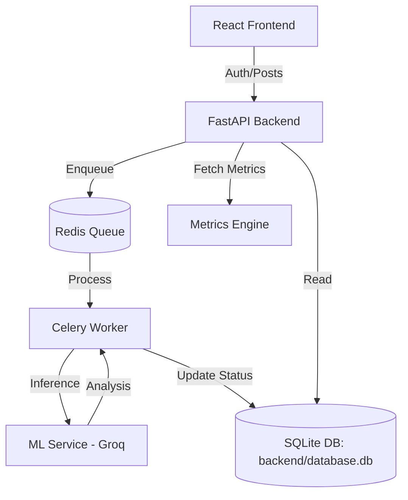

# SafeGuard AI: Content Moderation Engine

A modular, high-performance content moderation system featuring a **FastAPI backend**, **Groq-powered ML inference**, **Celery async workers**, and a **premium React frontend** with full **Role-Based Access Control (RBAC)**.

---

## 🏗️ Architecture Design



---

## 🔑 Key Features
*   **Role-Based Access Control (RBAC)**: Distinct paths for `Moderator` (Full analytics & overrides) and `User` (Community feed only).
*   **Modern Routing**: Separated Landing Page (`/`) and Application (`/dashboard`) using `react-router-dom`.
*   **Real-time Moderation**: Sub-200ms text and image analysis via Groq LPU.
*   **Unified Handoff**: Simplified local orchestration via `./run_local.sh`.

---

## 🚀 How to Run

### 1. Prerequisites
- **[uv](https://github.com/astral-sh/uv)** (Fast Python manager)
- **Node.js 18+** & npm
- **Docker** (for Redis sidecar)

### 2. Unified Local Execution (Recommended)
We've provided a single script to launch the full background stack (Redis, Backend, Worker, ML Service):
```bash
./run_local.sh
```
*Note: Run this in Git Bash or WSL on Windows.*

### 3. Frontend Execution
```bash
cd frontend
npm install
npm run dev
```
Visit **`http://localhost:5173`** to view the landing page.

---

## 🧪 Testing & Data (50+ Stress Test)
The moderation engine has been verified with:
- **50 Text Posts**: Mixing safe, toxic, and boundary cases.
- **50 Kaggle Images**: From the NSFW detection dataset.
- Total of **100+ samples** are currently in the database for auditing.

---

## 🔒 Data Management & Security
*   **Database**: All data (Users, Roles, Posts) is persisted in a local **SQLite** file at `backend/database.db`.
*   **Password Security**: User passwords are never stored in plain text. We use **Bcrypt hashing** (via `passlib`) before persistence.
*   **Image Processing**: Binary image data is transmitted to the ML service using **Base64 encoding** over secure internal HTTP requests. No images are stored indefinitely on the host filesystem outside of the DB references.
*   **Session Security**: Authentication is handled via **JWT (JSON Web Tokens)** with a 30-minute expiration for secure session management.

---

## 📡 API Documentation (Latest)

| Endpoint | Method | Payload | Description |
| :--- | :--- | :--- | :--- |
| `/register` | POST | `{username, password, role}` | Creates a new `user` or `moderator`. |
| `/login` | POST | `{username, password}` | Retrieves JWT token and role. |
| `/posts` | POST | `{content, image_url?}` | Submits content for async moderation (Auth required). |
| `/posts` | GET | - | Retrieves a list of all posts (Filtered for Users). |
| `/metrics` | GET | - | Retrieves Accuracy, Precision, and Recall data. |
| `/posts/{id}/moderate` | PATCH | `?correct_label=TOXIC` | Manual override (Moderator only). |

---

## 📁 Repository Map
- **`frontend/`**: React + Vite + Tailwind UI.
- **`backend/`**: FastAPI endpoints + SQLModel.
- **`ml-service/`**: Groq-powered inference engine.
- **`run_local.sh`**: The "magic" script for local orchestration.
nual override of ML decision. |
