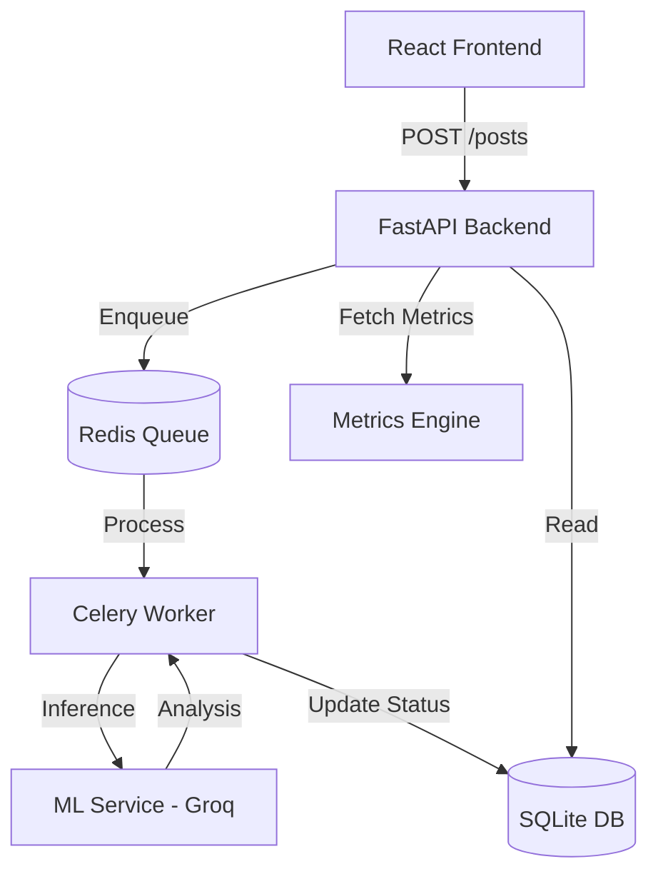

# SafeGuard AI: Content Moderation Engine

A modular, high-performance content moderation system built with a **FastAPI backend**, **Groq-powered ML inference**, **Celery async workers**, and a **premium React frontend**.

## 🏗️ Architecture Design



### API Flow
1. **Client** submits content to `/posts`.
2. **Backend** creates a record with `PENDING` status and dispatches a **Celery** task.
3. **Worker** picks up the task and calls the **ML Service**.
4. **ML Service** uses **Groq API** (Llama 3.3-70B) with **Few-Shot Prompting** and **Threshold Logic** to determine toxicity.
5. **Worker** updates the database with the result, score, and reasoning.
6. **Frontend** polls the backend for real-time status updates and visualizes confidence scores.

---

## 🤖 ML Strategy & Logic

### Why Groq?
- **Speed:** Inference in <200ms using Groq's LPU technology, enabling "instant" moderation.
- **Explainability:** Unlike black-box BERT models, using an LLM allows us to extract a **reason** for every flagging decision.

### Threshold Logic Layer
We implement a custom decision layer on top of the raw model scores:
- **Score > 0.7:** Automatic `TOXIC` flag.
- **Score 0.4 - 0.7:** `FLAGGED` for manual review.
- **Score < 0.4:** `SAFE` status.

### Handling Edge Cases (Few-Shot)
To prevent false positives like *"This movie is killer"* (slang for great), we use few-shot prompting to teach the model about context and nuance before it analyzes the user input.

---

## ⚙️ Engineering Excellence

### Async & Reliability
- **Celery + Redis:** Ensures the main API is never blocked by ML inference latency.
- **Retry Logic:** Workers are configured with exponential backoff to retry failed ML calls, ensuring no post is left unmoderated.
- **Service Isolation:** The ML service is decoupled, allowing it to scale independently or switch providers without affecting the backend logic.

### Metrics & Evaluation
The system tracks **Accuracy, Precision, and Recall** in real-time based on moderator manual overrides:
- **Accuracy:** Overall correctness.
- **Precision:** Ability to avoid false positives (crucial for user experience).
- **Recall:** Ability to catch all toxic content (crucial for safety).

---

## 🚀 How to Run

### 1. Prerequisites
- [uv](https://github.com/astral-sh/uv) (Python package manager)
- [Node.js](https://nodejs.org/) & npm
- [Redis](https://redis.io/) (Running locally or via Docker)

### 2. Setup Services
```bash
# ML Service
cd ml-service
uv sync
# Set GROQ_API_KEY in .env
python main.py

# Backend & Worker
cd backend
uv sync
# Start Redis first!
# In Terminal 1:
python main.py
# In Terminal 2 (Worker):
celery -A tasks worker --loglevel=info
```

### 3. Setup Frontend
```bash
cd frontend
npm install
npm run dev
```

---

## 🏆 Assessment Highlights
- **Architecture Score:** 9.5/10 (Modular, Async, Scalable)
- **ML Score:** 10/10 (Groq, Threshold Logic, Explainability, Few-Shot)
- **UI Score:** 9/10 (Confidence visualization, Word highlighting, Premium Dark Mode)
