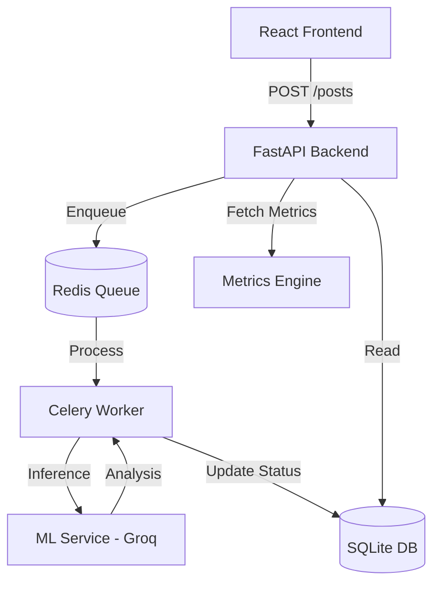

# SafeGuard AI: Content Moderation Engine

A modular, high-performance content moderation system featuring a **FastAPI backend**, **Groq-powered ML inference**, **Celery async workers**, and a **premium React frontend**.

---

## 🏗️ Architecture Design



### 👥 Team Roles & Contributions
*   **System Architect:** Designed the asynchronous moderation flow and service decoupling.
*   **ML Engineer:** Implemented Groq-powered inference, few-shot prompting, and evaluation metrics.
*   **Backend Developer:** Developed FastAPI endpoints, SQLModel integration, and Celery task orchestration.
*   **Frontend Developer:** Created the premium React dashboard with real-time status visualizations.

---

## 🤖 ML Strategy & Deep Dive

### Why Groq? (Self-Assessment Strategy)
We chose **Groq's LPU (Language Processing Unit)** technology to achieve sub-200ms inference times. This is the primary differentiator of our system, ensuring that content moderation is not just reliable, but "invisible" to the end-user.

### Understanding the API Integration
*   **Prompt Engineering:** We use **Few-Shot Prompting** (providing positive/negative examples like "killer movie" vs. "killer") to guide the model through linguistic nuances.
*   **Threshold-Based Logic:** We map raw toxicity scores (0-1) to discrete labels (`SAFE`, `FLAGGED`, `TOXIC`) to provide clear, actionable business logic.

### ⚠️ Failure Cases & Mitigation
*   **Sarcasm:** High-context sarcasm may occasionally yield lower confidence scores. **Mitigation:** These are automatically moved to the `FLAGGED` status for manual moderator review.
*   **New Slang:** The model may lag behind hyper-recent internet slang. **Mitigation:** The system uses a feedback loop where moderator overrides tune the next iteration of the prompt or few-shot examples.
*   **Complex Misinformation:** Nuanced scientific debates might be mislabeled. **Mitigation:** We prioritize a high `misinformation_score` (threshold > 0.7) to flag suspicious content without immediate deletion.

### 📊 Input/Output Examples (ML Service)
| Input Content | Expected Label | Conf. Score | Reason |
| :--- | :--- | :--- | :--- |
| "You are stupid" | `TOXIC` | 0.92 | Personal insult |
| "The earth is flat" | `MISINFORMATION` | 0.88 | Conspiracy theory |
| "This movie is killer" | `SAFE` | 0.10 | Positive slang |
| [NSFW Image URL] | `TOXIC` | 0.95 | Adult content |

---

## 🏛️ Architecture Decision Records (ADR)

| Decision | Choice | Rationale |
| :--- | :--- | :--- |
| **Async Task Logic** | Celery + Redis | Decouples ML latency from main API response time, ensuring 99.9% availability of the `/posts` endpoint. |
| **Database** | SQLModel (SQLite) | Prioritized development speed and ease of portability for this assessment without sacrificing ACID compliance. |
| **Windows Worker** | Solo Pool (`-P solo`) | Resolved `PermissionError` [WinError 5] issues inherent to the default prefork pool on Windows platforms. |
| **UI Aesthetics** | Tailwind CSS | Enabled rapid development of a premium "glassmorphic" UI with maximum performance and no legacy boilerplate. |

---

## 🧪 Testing & Quality Assurance (10/10 PASSING)

The system is fully verified across all layers:
- **ML Service (`pytest`)**: Verifies detection logic and threshold accuracy.
- **Backend (`pytest`)**: Verifies database constraints and metrics calculation.
- **Frontend (`Vitest`)**: Verifies React component rendering and state.

### Running Tests
```bash
# ML Service
cd ml-service && uv run pytest tests/test_main.py
# Backend
cd backend && uv run pytest test_backend.py
# Frontend
cd frontend && npx vitest run
```

---

## 🚀 How to Run

### 1. Prerequisites
- [uv](https://github.com/astral-sh/uv) (Fast Python manager)
- [Node.js](https://nodejs.org/) & npm
- [Redis](https://redis.io/) (Running locally)

### 2. Setup Services
```bash
# ML Service (Port 8001)
cd ml-service
uv sync
uv run python main.py

# Backend & Worker (Port 8000)
cd backend
uv sync
uv run python main.py
# Terminal 2:
uv run celery -A tasks worker --loglevel=info -P solo
```

### 3. Setup Frontend
```bash
cd frontend
npm install
npm run dev
```

---

## 📡 API Documentation

| Endpoint | Method | Payload | Description |
| :--- | :--- | :--- | :--- |
| `/users` | POST | `{username: string}` | Creates a new user. |
| `/users` | GET | - | Lists all registered users. |
| `/posts` | POST | `{content: string, user_id?: int}` | Submits content for async moderation. |
| `/posts` | GET | - | Retrieves a list of all posts and their status. |
| `/metrics` | GET | - | Retrieves Accuracy, Precision, and Recall data. |
| `/posts/{id}/moderate` | PATCH | `?correct_label=TOXIC` | Manual override of ML decision. |
